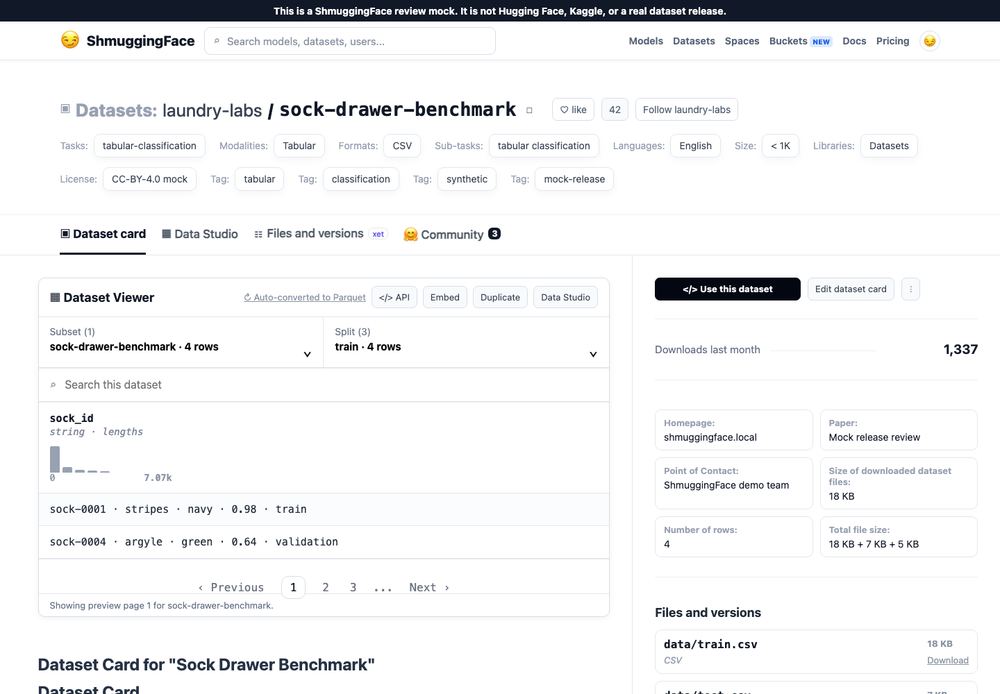
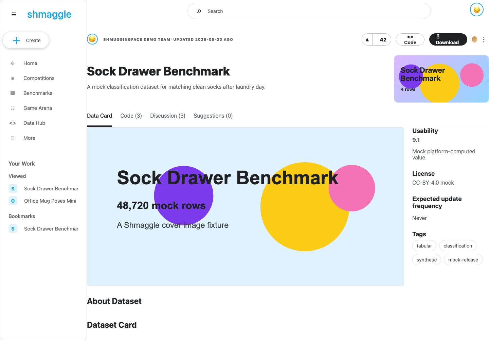

# ShmuggingFaceCore

[](LICENSE)
[](package.json)
[](package.json)

ShmuggingFaceCore generates review-ready static minisites that mock dataset
release pages before a real Hugging Face or Kaggle publication. The goal is to
make pre-release review links feel realistic enough to catch copy, metadata,
preview, file, and download problems while making it unmistakable that reviewers
are looking at a mock.

Created by [Shay Palachy Affek](http://www.shaypalachy.com/).

The generated app has:

- a neutral landing page with two primary reviewer paths;
- a ShmuggingFace 😏 Hugging Face-style dataset page;
- a Shmaggle Kaggle-style dataset page;
- table previews, file lists, mock download links, metadata, and discussion
  affordances;
- a no-secrets static output that can be deployed to Cloudflare Pages.

Every generated page includes a prominent mock notice:

> This is a ShmuggingFace review mock. It is not Hugging Face, Kaggle, or a real
> dataset release.

## Generated Page Preview

The demo generator renders both review surfaces from the same dataset config:

| ShmuggingFace dataset page | Shmaggle dataset page |
|---|---|
|  |  |

These previews are generated from `examples/silly-datasets/` and intentionally
keep the mock brand, mock notice, and non-production cues visible.

## Quick Start

Reference consumer demo:
[`ShmuggingFace/silly-dataset-release-demo`](https://github.com/ShmuggingFace/silly-dataset-release-demo)
deploys to
<https://shmuggingface-silly-dataset-demo-3rq.pages.dev/>.

Create `shmuggingface.config.mjs` in a dataset-producing project:

```js
export default {
  site: {
    title: "Dataset Release Review",
    owner: "example-team",
    visibility: "Public mock demo",
  },
  datasets: [{
    title: "Sock Drawer Benchmark",
    owner: "laundry-labs",
    subtitle: "A mock classification dataset for matching clean socks.",
    description: "A fake release used to review copy and data previews.",
    descriptionHtml: "<h2>Dataset Card</h2><p>A fake release used to review copy and data previews.</p>",
    coverImage: "dataset-cover-image.png",
    license: "CC-BY-4.0 mock",
    task: "tabular-classification",
    rowCount: 12000,
    tags: ["tabular", "synthetic", "mock-release"],
    splits: ["train", "valid", "test"],
    subsets: ["sock-drawer-benchmark"],
    mockOnly: {
      kaggleUsability: "9.1",
      kaggleMedals: "Socksilver",
    },
    files: [{
      path: "data/train.csv",
      size: "18 KB",
      kind: "CSV",
      sourcePath: "data/train.csv",
      about: "Training split for the mock release.",
    }],
    columns: ["sock_id", "pattern", "pair_probability"],
    rows: [{ sock_id: "sock-0001", pattern: "stripes", pair_probability: "0.98" }],
    profileStats: {
      files: {
        "data/train.csv": {
          rowCount: 12000,
          columns: {
            pattern: {
              uniqueCount: 4,
              nullRate: 0,
              topValues: [
                { value: "stripes", count: 4200 },
                { value: "plain", count: 3900 },
              ],
            },
            pair_probability: {
              uniqueCount: 841,
              nullRate: 0.002,
              min: 0.01,
              max: 0.99,
              topValues: [{ value: "0.98", count: 38 }],
            },
          },
        },
      },
    },
  }],
};
```

Then generate the static site:

```sh
npx @shmuggingface/core build --config shmuggingface.config.mjs --out dist
```

For repeatable downstream builds, pin the GitHub release tag:

```json
{
  "dependencies": {
    "@shmuggingface/core": "github:ShmuggingFace/ShmuggingFaceCore#v1.0.2"
  }
}
```

During local development from this repository:

```sh
npm run build:demo
```

## Config Contract

`shmuggingface.config.mjs` should export plain JSON-serializable data. Keep build
logic in a separate script that writes the config, then let ShmuggingFaceCore
render that data into the review app.

The generator warns on unknown fields and deprecated compatibility fields:

```js
const result = await generateSite(config, { outDir: "dist" });
console.log(result.warnings);
```

Use strict validation in CI when you want those warnings to fail the build:

```sh
npx shmuggingface build --config shmuggingface.config.mjs --out dist --strict-config
```

Run optional Hugging Face-facing validation when a downstream project wants a
pre-publish check:

```sh
npx shmuggingface build --config shmuggingface.config.mjs --out dist --validate-hf
```

Use `meta` for downstream-only metadata that the generator should preserve as
opaque config context in `manifest.json`. Use dataset-level `mockOnly` for
values that intentionally simulate platform-computed state and should never be
confused with real provider data.

## Dataset Config Fields

Each dataset entry supports the following release-review fields:

- `description`: plain-text fallback for the Hugging Face and Kaggle dataset
  card sections.
- `descriptionHtml`: optional pre-rendered dataset-card HTML. When present, it
  is injected raw into both platform card sections. Use this when a downstream
  project renders a README or other Markdown source before writing
  `shmuggingface.config.mjs`.
- `coverImage`: optional image path resolved relative to the config file. The
  generator copies it into `assets/<dataset-slug>/cover.<ext>` and renders it as
  a Kaggle-style data-card banner.
- `splits`: optional Dataset Viewer split labels. Defaults to
  `["train", "validation", "test"]`.
- `splitRowCounts`: optional object keyed by split name. These counts are
  rendered in viewer split controls and metadata independently from the preview
  `rows` array. Multi-subset datasets may instead use nested counts such as
  `{ subsetName: { train: 1200, validation: 150 } }`.
- `huggingFaceValidation`: optional object for Hugging Face-facing checks.
  Set `enabled: true` on a dataset or pass `--validate-hf` to the CLI for a
  dependency-free smoke check of local README front matter, local Parquet magic
  bytes, and split-name safety. Add `loadDataset: true` to attempt a Python
  `datasets.load_dataset()` round trip against `datasetDir`, compare loaded
  split names to `splits`, and compare flat `splitRowCounts` where available.
  The round trip is explicit because it requires Python plus the Hugging Face
  `datasets` package in the downstream environment.
- `subsets`: optional Dataset Viewer subset labels. Defaults to the dataset
  slug.
- `rowCount`: optional dataset-level row count. If omitted, the generator falls
  back to `profileStats.rowCount` for dataset-level profiles, then preview
  `rows.length`.
- `profileStats`: optional profiling metadata for the Shmaggle Data Explorer.
  Prefer file-scoped profiles under `profileStats.files["path/to/file.csv"]` so
  the explorer can label them as full-file stats for the active file. A
  dataset-level profile can also be supplied as `profileStats.rowCount` plus
  `profileStats.columns`, and the UI labels it as dataset-level stats. Column
  entries support `uniqueCount`, `nullRate`, `min`, `max`, and `topValues`.
  `topValues` may contain `{ value, count }` objects, with optional `rate`
  values.
- `rows`: preview rows rendered in table surfaces. If `profileStats` is omitted,
  the Shmaggle Data Explorer derives column summaries only from these preview
  rows and labels them as preview-sample stats with the sample size.
- `files[].about`: optional Kaggle Data Explorer "About this file" copy. If it
  is omitted, the mock uses a generic preview description based on the file
  name.
- `files[].schema`: optional per-file schema metadata preserved in
  `manifest.json`. Downstream configs can use this for primary keys,
  foreign-key notes, or generated schema objects.
- `files[].columnDtypes`: optional object keyed by column name. File surfaces
  use it to show how many schema columns are described without requiring
  preview rows to carry the whole schema.
- `files[].rowCount` and `files[].splitRowCounts`: optional per-file counts for
  relational tables or other artifacts.
- `tableGroups`, `docsGroups`, `notebookGroups`, and `validationGroups`:
  optional arrays of artifact groups. Each group accepts `title`,
  `description`, `meta`, and `files`. Group files use the same file fields as
  the legacy flat `files` array and are rendered in grouped HF and Shmaggle file
  surfaces.
- `artifactGroups`: optional grouped form equivalent to the group-specific
  fields above, with keys such as `tables`, `docs`, `notebooks`, `validation`,
  or `manifests`. Unknown keys warn, and fail when `--strict-config` is used.
- `meta`: optional opaque downstream metadata. The generator preserves this in
  `manifest.json` and does not interpret fields inside this object. `meta` is
  also accepted on `site` and `files[]`.
- `mockOnly.kaggleUsability`: optional Kaggle-style usability score used only in
  the mock UI. In real Kaggle this is platform-computed.
- `mockOnly.kaggleMedals`: optional Kaggle-style medal indicator used only in
  the mock UI. In real Kaggle this is platform-computed.

Deprecated compatibility aliases:

- `kaggleUsability`
- `kaggleMedals`

They still render for older configs, but new downstream integrations should use
`mockOnly.kaggleUsability` and `mockOnly.kaggleMedals` so mock-only
platform-computed values stay explicit.

## Cloudflare Pages

The generated `dist/` folder is static and can be uploaded directly:

```sh
wrangler pages deploy dist --project-name <cloudflare-pages-project> --branch main
```

Closed review links should be protected with Cloudflare Access at the Pages
hostname. This repository intentionally does not store Access policies, reviewer
emails, Cloudflare tokens, or provider payloads. Use provider-managed secrets in
GitHub Actions and local Wrangler auth for deployment.

## Download Backing

Every file listed in a dataset must have real backing:

- Use `sourcePath` for small files that should be copied into the generated
  static site. Paths are resolved relative to `shmuggingface.config.mjs`.
- Use `downloadUrl` for large files or externally stored files, such as Git LFS,
  S3/R2, GCS, Azure Blob, or a signed release asset.
- Optional `storage` and `downloadLabel` fields control how external links are
  described in the UI.

Example:

```js
files: [
  { path: "data/train.csv", size: "18 KB", kind: "CSV", sourcePath: "data/train.csv" },
  {
    path: "data/full.parquet",
    size: "8 GB",
    kind: "Parquet",
    storage: "Git LFS",
    downloadUrl: "https://github.com/org/repo/raw/main/data/full.parquet",
    downloadLabel: "Open Git LFS",
  },
]
```

Relational releases can keep the flat `files` array for backwards-compatible
consumers while adding grouped artifacts for the richer file surfaces:

```js
splitRowCounts: {
  public: { train: 8750, validation: 1200, test: 1050 },
  internal: { train: 350, validation: 40, test: 30 },
},
files: [{ path: "data/preview.csv", size: "24 KB", sourcePath: "data/preview.csv" }],
tableGroups: [{
  title: "Core relational tables",
  description: "Normalized tables included in the release bundle.",
  files: [{
    path: "tables/customers.parquet",
    size: "18 MB",
    kind: "Parquet",
    downloadUrl: "https://example.com/tables/customers.parquet",
    rowCount: 8750,
    columnDtypes: { customer_id: "int64", segment: "string" },
    schema: { primaryKey: ["customer_id"] },
  }],
}],
docsGroups: [{
  title: "Documentation",
  files: [{ path: "docs/data_dictionary.md", size: "12 KB", sourcePath: "docs/data_dictionary.md" }],
}],
validationGroups: [{
  title: "Validation and manifests",
  files: [{ path: "validation/manifest.json", size: "6 KB", sourcePath: "validation/manifest.json" }],
}]
```

## Optional Hugging Face Validation

ShmuggingFaceCore stays a lightweight static generator by default. It does not
install Python, PyArrow, Hugging Face `datasets`, or a YAML parser. The opt-in
validation path performs dependency-free smoke checks first:

- a local dataset-card `README.md` exists and has parseable-looking YAML front
  matter with top-level metadata;
- local `.parquet` files begin and end with Parquet `PAR1` magic bytes without
  reading the whole file into memory;
- configured split names avoid spaces and slashes.

To add a Hugging Face round trip in a downstream release job, install the Python
dependencies there and opt in explicitly:

```js
huggingFaceValidation: {
  enabled: true,
  datasetDir: "release/huggingface",
  loadDataset: true,
}
```

```sh
python -m pip install datasets pyarrow
npx shmuggingface build --config shmuggingface.config.mjs --out dist --validate-hf --strict-config
```

Hugging Face validation findings are returned as `result.validationWarnings`,
printed by the CLI, and written to `manifest.json` as `validationWarnings` so
review artifacts retain the pre-publish check results. Config-contract warnings
remain separate in `result.warnings`.

## GitHub Actions

Downstream projects can run the generator in CI and deploy with Wrangler:

```yaml
name: Deploy dataset release mock
on:
  workflow_dispatch:
  push:
    branches: [main]
jobs:
  deploy:
    runs-on: ubuntu-latest
    permissions:
      contents: read
      deployments: write
    steps:
      - uses: actions/checkout@v4
      - uses: actions/setup-node@v4
        with:
          node-version: 22
      - run: npm ci
      - run: npx shmuggingface build --config shmuggingface.config.mjs --out dist
      - uses: cloudflare/wrangler-action@v3
        with:
          apiToken: ${{ secrets.CLOUDFLARE_API_TOKEN }}
          accountId: ${{ secrets.CLOUDFLARE_ACCOUNT_ID }}
          command: pages deploy dist --project-name ${{ vars.CLOUDFLARE_PAGES_PROJECT }} --branch main
```

## Design Boundary

ShmuggingFaceCore is for review mocks, not impersonation. Generated sites should
be accurate enough for release review but must keep the mock brand, mock notice,
and non-production URLs visible.

## Contributing

Keep changes focused on review reliability: static output must remain
no-secrets, generated pages must preserve clear mock branding, and new config
fields should be documented in this README with tests for generated HTML or
manifest behavior. Run the full check before opening a PR:

```sh
npm run check
```

## Planning

- [Review synthesis](docs/shmuggingface_review_synthesis.md)
- [Next 10 review PRs](docs/next_10_review_prs.md)

## Credits

Created by [Shay Palachy Affek ](http://www.shaypalachy.com/) [[GitHub](https://github.com/shaypal5)]
